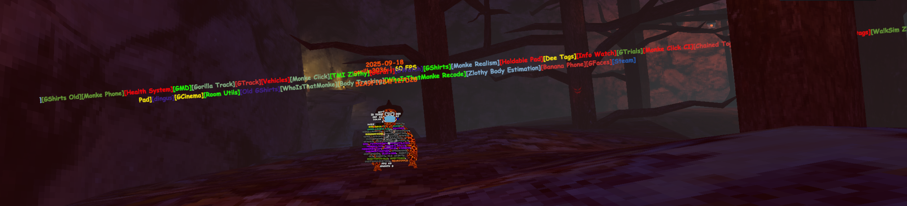
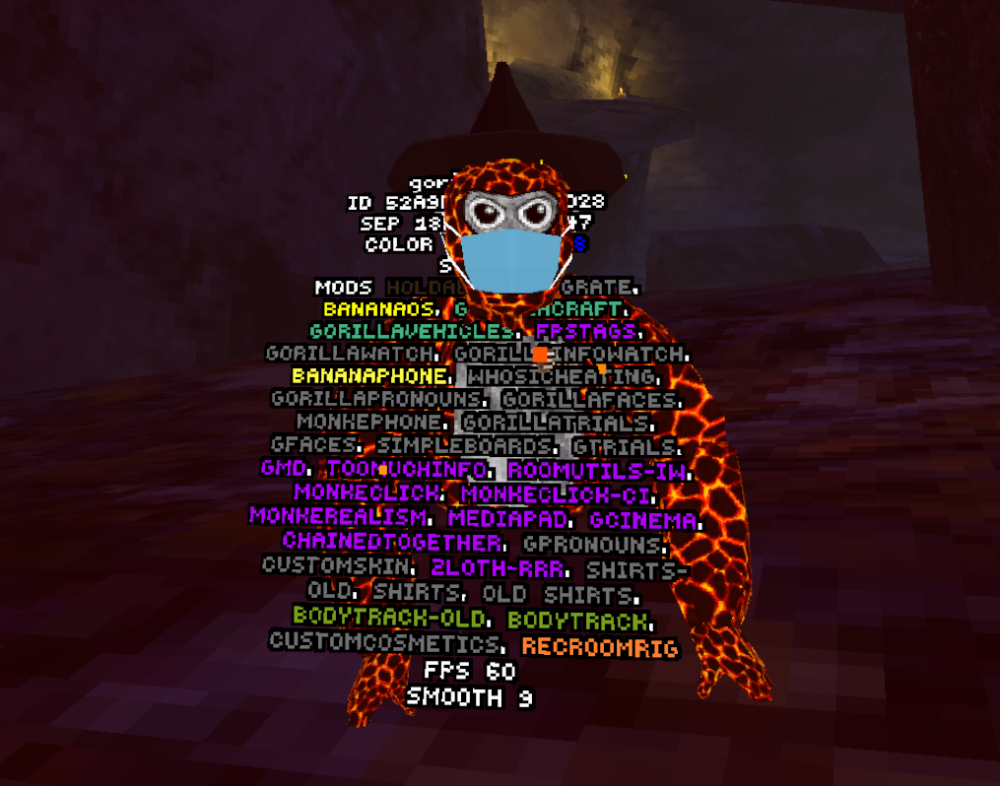

# AllTheProps

---

## Description

AllTheProps is a **harmless Gorilla Tag mod** that sets your Photon custom properties to include basically **every known mod**.

If someone is using a **nametag or info mod**, they’ll see a literal **dictionary of mods** attached to your player.

become "the walking dictionary"

---

## Features

- Sets all known Gorilla Tag mods as Photon properties.  

---

## Installation

1. Copy `AllTheProps.dll` to your `BepInEx/plugins` folder.  
2. Launch **Gorilla Tag**.   

---

## Example Screenshot

---

## Disclaimer

AllTheProps is an unofficial mod and is not affiliated with or endorsed by Gorilla Tag or Another Axiom LLC. Portions of the materials referenced here remain the property of Another Axiom LLC. © 2021 Another Axiom LLC.